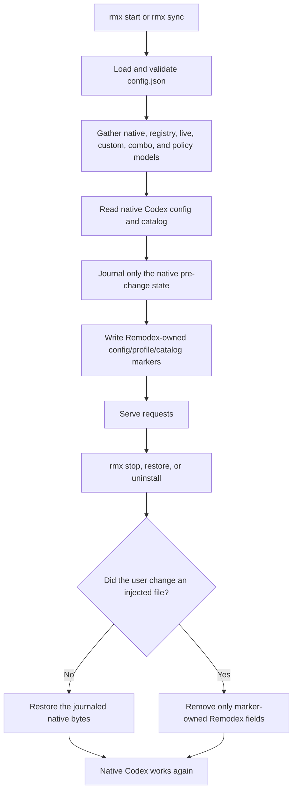
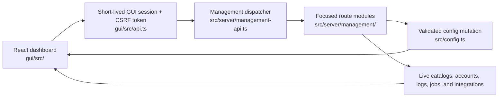

# Remodex Codebase Guide

> A beginner-friendly map of the repository, its runtime, and the safest places to make future changes.
>
> Snapshot checked on 2026-08-30 against package version `1.0.0`.

## 1. What this guide is for

Remodex is a large project. Looking for one small feature can otherwise mean opening many files before finding the real source of the behavior. This guide is the starting point for future work. It explains what the major parts do, how they connect, and which file normally owns each kind of change.

Use this document in this order:

1. Read the [simple mental model](#2-the-simple-mental-model) once.
2. Use the [repository map](#3-repository-map) to find the correct area.
3. Use the [change map](#16-where-to-make-common-changes) to find likely files.
4. Read the nearest `AGENTS.md` before editing anything.
5. Follow the [safe change workflow](#18-safe-workflow-for-future-changes).

This is a navigation guide, not a replacement for the code. The code is still the final source of truth. When behavior changes, update this file in the same pull request so the map stays useful.

Useful words used in this guide:

| Word | Simple meaning |
| --- | --- |
| Client | The program talking to Remodex, such as Codex CLI, Codex App, Claude Code, or another API tool. |
| Proxy | A middle program. It receives a request, chooses where it should go, changes its format when needed, and forwards it. |
| Provider | The company or server that runs an AI model, such as OpenAI, Anthropic, Google, Ollama, or OpenRouter. |
| Adapter | A translator between Remodex's common internal format and one provider's API format. |
| Route | The final provider, account, and model chosen for one request. |
| Data plane | The AI-facing API, mainly `/v1/*`. This is where model requests travel. |
| Management plane | The dashboard-facing API, `/api/*`. This changes settings and reads status. |
| Streaming | Returning pieces of an answer as they arrive instead of waiting for the whole answer. |
| SSE | “Server-Sent Events,” a common text format for streaming responses over HTTP. |
| WebSocket | A long-lived two-way connection. Both client and server can send messages over it. |
| Sidecar | A small helper model call used beside the main model, for example to search the web or describe an image. |
| Catalog | The model list shown to Codex and other clients. |
| Loopback | The current computer only, normally `127.0.0.1`, `localhost`, or `::1`. |
| Invariant | A rule that must remain true. For example, secrets must never be written to request logs. |

## 2. The simple mental model

Remodex is one local gateway between AI coding clients and many AI providers.

The normal first run is:

```bash
rmx start
```

That starts the proxy on port `10100`, synchronizes the current model catalog into Codex, and serves the dashboard at [http://localhost:10100](http://localhost:10100). Use `rmx start --port 8080` when a different port is needed.


The key idea is that every supported client and provider does not need a custom connection to every other one. Remodex converts requests into a common internal shape. An adapter then converts that common shape into the provider's wire format, meaning the exact JSON and HTTP structure sent across the network.

There are two separate groups of routes:

- `/v1/*` is the AI request surface. It serves Responses, Chat Completions, Anthropic Messages, models, images, search, and live/realtime traffic.
- `/api/*` is the management surface. The React dashboard and headless CLI commands use it to manage providers, models, accounts, settings, logs, storage, and updates.

These two surfaces deliberately do not share credentials. A key that opens the AI API must not automatically become an administrator key.

## 3. Repository map

The checkout contained 4,254 tracked files at the time of this review. The large number mostly comes from tests, documentation, translations, and historical development records. The active runtime remains concentrated under `src/`.

| Path | What it contains | Edit guidance |
| --- | --- | --- |
| [`src/`](src/) | Bun-native TypeScript runtime: server, routing, adapters, provider catalog, accounts, config, CLI, and integrations. | Read [`src/AGENTS.md`](src/AGENTS.md) first. Most product behavior begins here. |
| [`tests/`](tests/) | Root Bun test suite. Most runtime behavior has a focused `*.test.ts` here. | Add a regression test for every behavior change in `src/`. |
| [`gui/`](gui/) | React 19 and Vite dashboard. Source is in `gui/src`; tests are in `gui/tests`. | Read [`gui/AGENTS.md`](gui/AGENTS.md). Never edit `gui/dist` manually. |
| [`docs-site/`](docs-site/) | Public Astro + Starlight website at `opencodex.me`. | Read [`docs-site/AGENTS.md`](docs-site/AGENTS.md). English is the main source. |
| [`structure/`](structure/) | Maintainer architecture rules and design decisions. | Read the relevant note before changing a shared subsystem. |
| [`scripts/`](scripts/) | Test, privacy, packaging, release, model-metadata, and development-hook tools. | Read [`scripts/AGENTS.md`](scripts/AGENTS.md). [`scripts/release.ts`](scripts/release.ts) is the release authority. |
| [`.github/`](.github/) | CI workflows, issue forms, pull-request template, CODEOWNERS, and GitHub automation scripts. | Read [`.github/AGENTS.md`](.github/AGENTS.md). Workflow changes require security review. |
| [`devlog/`](devlog/) | Tracked planning and historical investigation records. `_plan` is open work; `_fin` is closed work; `_chase` holds reference material. | Never place unreleased security findings here. Use `.tmp/` instead. |
| [`docs/`](docs/) | Architecture decision records, design-system notes, and older focused investigations. | Useful evidence, but current behavior must be confirmed in code. |
| [`bin/`](bin/) | Published Node launchers. They locate the bundled Bun runtime and launch the TypeScript CLI. | Change only when package startup behavior changes. |
| [`dist/`](dist/) | Generated or packaged command output. | Do not treat it as primary source. Rebuild it through the owning script. |
| [`assets/`](assets/) | Images and animations used by README files, docs, and release/PR material. | Reuse existing assets where possible. |
| [`readme/`](readme/) | Japanese, Korean, Russian, and Simplified Chinese README translations. | Keep them consistent with root [`README.md`](README.md). |
| [`package.json`](package.json) | Package identity, commands, dependencies, published file list, and Node/Bun runtime contract. | Dependency or release-facing changes require extra review. |
| [`bun.lock`](bun.lock) | Exact installed package versions. | Usually changed by `bun install`, not by hand. |
| [`bunfig.toml`](bunfig.toml) | Bun test discovery and mandatory test-home preload. | Its safety isolation is load-bearing; do not casually remove it. |
| [`tsconfig.json`](tsconfig.json) | Strict TypeScript checking for `src/`. | The project is strict and expects `bun run typecheck` to pass. |
| [`AGENTS.md`](AGENTS.md) | Repository-wide work, review, security, branch, testing, and documentation rules. | Always read it before work. Nested instructions add more rules. |
| [`AGENTS_INSTALL.md`](AGENTS_INSTALL.md) | Rules for agents installing or operating Remodex, including human-consent actions. | Keep runtime consent rules here, not in development instructions. |
| [`MAINTAINERS.md`](MAINTAINERS.md) | Authoritative review and merge policy. | This overrides summaries elsewhere. |
| [`SECURITY.md`](SECURITY.md) | Public security reporting policy. | Do not publish an unfixed finding in repository history. |
| [`CONTRIBUTING.md`](CONTRIBUTING.md) | Contributor setup and submission guidance. | Keep commands synchronized with actual package scripts. |

The old `go/` runtime is intentionally absent and ignored. New runtime work belongs in Bun TypeScript. If native code returns in the future, it should be a small module attached to this runtime, not a second full implementation.

### Size of the active areas

These counts are useful when estimating the scope of a change:

| Area | Snapshot count |
| --- | ---: |
| Runtime files under `src/` | 499 |
| TypeScript runtime files | 484 |
| Root tests under `tests/` | 657 |
| Dashboard source files under `gui/src/` | 222 |
| English public documentation pages | 44 |
| Provider registry entries | 78 |

## 4. Runtime source map

[`src/index.ts`](src/index.ts) is the public programmatic entry point. [`src/cli/index.ts`](src/cli/index.ts) is the executable command dispatcher. [`src/server/index.ts`](src/server/index.ts) starts the Bun server and owns route order.

Every top-level runtime area has a distinct job:

| Path | Responsibility |
| --- | --- |
| [`src/adapters/`](src/adapters/) | Provider request builders and response parsers. All providers eventually use one of these adapters. |
| [`src/chat/`](src/chat/) | Translation helpers for the OpenAI Chat Completions inbound and outbound shapes. |
| [`src/claude/`](src/claude/) | Claude Code and Claude Desktop request translation, model aliases, auth-mode detection, context rules, agent-file injection, and Desktop profile management. |
| [`src/cli/`](src/cli/) | User commands such as `start`, `stop`, `provider`, `account`, `models`, `agent`, `observe`, and `integration`. |
| [`src/clients/`](src/clients/) | Read-only configuration export for supported third-party clients. |
| [`src/codex/`](src/codex/) | Codex accounts, catalog, injection, restore, history, native-login profiles, quotas, pool rotation, and WebSocket admission. |
| [`src/combos/`](src/combos/) | Virtual models that choose from several real models using failover or weighted round-robin. |
| [`src/generated/`](src/generated/) | Generated model metadata. Change the generator source, not the output directly. |
| [`src/github/`](src/github/) | Repository star-status handling for the dashboard consent surface. |
| [`src/grok/`](src/grok/) | Managed Grok Build configuration inspection, selection, injection, and restore. |
| [`src/images/`](src/images/) | Image/video tool loops, xAI generation clients, artifact storage, and synthetic tool calls. |
| [`src/integrations/`](src/integrations/) | Safe read/merge/write/restore machinery for external client configuration files. |
| [`src/lib/`](src/lib/) | Shared safety and utility code: limits, redaction, URL policy, retries, process control, memory budgets, secret permissions, and test guards. |
| [`src/oauth/`](src/oauth/) | OAuth provider login flows, callback server, credential store, refresh, health, and token guardian. |
| [`src/providers/`](src/providers/) | Canonical provider registry, model discovery, key pools, quota helpers, capability metadata, and provider-specific rules. |
| [`src/responses/`](src/responses/) | OpenAI Responses request parser, validation, compaction, continuation state, reasoning replay, tool groups, and spill-to-disk state. |
| [`src/routing/`](src/routing/) | Policy-profile evaluation, cost/health/quota evidence, analytics, and safe route-decision traces. |
| [`src/server/`](src/server/) | HTTP/WebSocket listener, endpoint handlers, auth/CORS, response execution, relays, lifecycle, management API, logging, and readiness. |
| [`src/storage/`](src/storage/) | Read-only storage scan plus opt-in archived-session cleanup, quarantine, restore, scheduling, and worker control. |
| [`src/tray/`](src/tray/) | Windows tray icon assets and PowerShell/TypeScript controller. |
| [`src/update/`](src/update/) | Version checks, update badges, background update jobs, package replacement, notification, and restart recovery. |
| [`src/usage/`](src/usage/) | Append-only usage records, price estimates, totals, summaries, and usage debugging. |
| [`src/vision/`](src/vision/) | Image-description sidecar, including Anthropic and OpenAI-backed paths. |
| [`src/web-search/`](src/web-search/) | Search sidecar execution, parsing, progress streaming, formatting, and synthetic tool calls. |
| [`src/bridge.ts`](src/bridge.ts) | Converts common adapter events into Responses SSE or JSON output. |
| [`src/config.ts`](src/config.ts) | Loads, validates, migrates, locks, and atomically writes Remodex configuration and runtime files. |
| [`src/reasoning-effort.ts`](src/reasoning-effort.ts) | Shared reasoning-effort ladder and normalization. |
| [`src/router.ts`](src/router.ts) | Turns a requested model name into a concrete provider, account, model, and route trace. |
| [`src/service.ts`](src/service.ts) | Installs and controls launchd, systemd, and Windows Task Scheduler background services. |
| [`src/stall-timeout.ts`](src/stall-timeout.ts) | Detects a response body that has stopped producing bytes for too long. |
| [`src/types.ts`](src/types.ts) | Shared TypeScript shapes for configuration, requests, events, providers, routes, accounts, and usage. |

## 5. How an AI request travels through Remodex

The main Responses implementation is split under [`src/server/responses/`](src/server/responses/). [`src/server/responses.ts`](src/server/responses.ts) is a small public facade, while [`src/server/responses/core.ts`](src/server/responses/core.ts) owns most execution.

A normal request follows these steps:

1. [`src/server/index.ts`](src/server/index.ts) receives the request through `Bun.serve`.
2. [`src/server/auth-cors.ts`](src/server/auth-cors.ts) checks the request host, browser origin, and data-plane credential.
3. [`src/server/lifecycle.ts`](src/server/lifecycle.ts) refuses new work if the process is draining and reserves an active-turn slot. The current hard limit is 256 active turns.
4. The endpoint-specific handler reads and bounds the body. Compressed bodies are handled by [`src/server/request-decompress.ts`](src/server/request-decompress.ts).
5. For Responses traffic, [`src/responses/parser.ts`](src/responses/parser.ts) converts the incoming JSON into `OcxParsedRequest`, the common internal request shape.
6. [`src/router.ts`](src/router.ts) resolves bare model ids, provider-prefixed ids, account selectors, combos, and routing profiles.
7. Account logic chooses an OAuth account, API key, Codex pool account, or the direct caller credential. The exact path depends on provider type.
8. [`src/server/adapter-resolve.ts`](src/server/adapter-resolve.ts) chooses the adapter. Per-model wire overrides can replace the provider-wide adapter when allowed.
9. The adapter's `buildRequest` method creates the upstream URL, headers, and body.
10. [`src/server/responses/core.ts`](src/server/responses/core.ts) performs the upstream fetch. It applies bounded retries, account/key failover, cooldowns, timeouts, sidecars, and cancellation.
11. The adapter converts the upstream body into common `AdapterEvent` values such as text, reasoning, tool calls, usage, completion, incomplete output, or error.
12. [`src/bridge.ts`](src/bridge.ts) converts those events into the client-facing Responses JSON or SSE stream. Chat and Anthropic surfaces have their own final formatting layers.
13. [`src/server/request-log.ts`](src/server/request-log.ts) and [`src/usage/log.ts`](src/usage/log.ts) record a secret-redacted result.
14. The lifecycle lease is released, allowing shutdown or restart to finish cleanly.

The adapter contract lives in [`src/adapters/base.ts`](src/adapters/base.ts). Every adapter provides:

- `buildRequest`: create the upstream request;
- `parseStream`: read a streaming response and yield common events;
- optional `parseResponse`: read a non-streaming JSON response;
- optional special fetch behavior when a provider cannot use the standard fetch path.

This common event layer is important. It stops the server from containing one large set of provider-specific `if` statements.

### Public data-plane endpoints

Route order is defined in [`src/server/index.ts`](src/server/index.ts). More specific routes are checked before the final unknown `/v1/*` guard.

| Endpoint | Purpose | Main owner |
| --- | --- | --- |
| `GET /healthz` | Simple process liveness. “Liveness” means the process is alive. | [`src/server/index.ts`](src/server/index.ts) |
| `GET /readyz` | Post-startup readiness. “Readiness” means startup sync completed and traffic may be sent. | [`src/server/readiness.ts`](src/server/readiness.ts), [`src/server/index.ts`](src/server/index.ts) |
| `GET /v1/models` | Model discovery for OpenAI and Claude-style clients. | [`src/server/index.ts`](src/server/index.ts), [`src/codex/catalog.ts`](src/codex/catalog.ts) |
| `POST /v1/responses` | Main OpenAI Responses endpoint. HTTP/SSE and opt-in WebSocket use the same path. | [`src/server/responses/core.ts`](src/server/responses/core.ts), [`src/server/ws-bridge.ts`](src/server/ws-bridge.ts) |
| `POST /v1/responses/compact` | Context compaction compatible with Responses clients. | [`src/server/responses/compact.ts`](src/server/responses/compact.ts), [`src/responses/compaction.ts`](src/responses/compaction.ts) |
| `POST /v1/chat/completions` | OpenAI-compatible Chat Completions input/output. | [`src/server/chat-completions.ts`](src/server/chat-completions.ts), [`src/chat/`](src/chat/) |
| `POST /v1/messages` | Anthropic Messages input/output for Claude Code and Claude Desktop. | [`src/server/claude-messages.ts`](src/server/claude-messages.ts), [`src/claude/inbound.ts`](src/claude/inbound.ts) |
| `POST /v1/messages/count_tokens` | Claude-compatible token estimate. | [`src/server/claude-messages.ts`](src/server/claude-messages.ts) |
| `POST /v1/images/generations` | OpenAI-style image generation relay. | [`src/server/images.ts`](src/server/images.ts) |
| `POST /v1/images/edits` | OpenAI-style image edit relay. | [`src/server/images.ts`](src/server/images.ts) |
| `GET /v1/opencodex/artifacts/{id}` | Serves an opaque, locally stored generated artifact. | [`src/images/artifacts.ts`](src/images/artifacts.ts) |
| `POST /v1/alpha/search` | Non-streaming search relay. | [`src/server/search.ts`](src/server/search.ts) |
| `POST /v1/live` and `POST /v1/realtime/calls` | Create voice/realtime calls. | [`src/server/live.ts`](src/server/live.ts) |
| Live/realtime WebSocket paths | Two-way sideband relay for voice/realtime sessions. | [`src/server/live.ts`](src/server/live.ts), [`src/server/index.ts`](src/server/index.ts) |

Any unknown `/v1/*` path returns a JSON 404. It never falls through to the dashboard's `index.html`. This prevents API mistakes from looking like successful HTML responses.

### Data-plane authentication

When Remodex binds only to loopback, local data-plane requests do not require a key. A non-loopback bind, such as `0.0.0.0`, requires configured data-plane keys.

The dedicated proxy header is `X-OpenCodex-API-Key`. The exact accepted headers differ because `Authorization` sometimes belongs to the upstream account, not to Remodex:

| Endpoint family | `Authorization: Bearer` | `X-OpenCodex-API-Key` | `X-Api-Key` |
| --- | --- | --- | --- |
| `/v1/responses` | Rejected as proxy admission | Required on remote binds | Rejected |
| `/v1/chat/completions` | Rejected as proxy admission | Required on remote binds | Rejected |
| `/v1/messages` | Accepted | Accepted | Accepted |
| `/v1/models` | Accepted | Accepted | Accepted |

The source-of-truth matrix is `AUTH_MATRIX` in [`src/server/auth-cors.ts`](src/server/auth-cors.ts). Proxy admission secrets are explicitly blocked from being forwarded upstream.

### Streaming, cancellation, and shutdown

Streaming work is mainly owned by:

- [`src/server/relay.ts`](src/server/relay.ts): bounded upstream stream inspection and forwarding;
- [`src/server/relay-eager.ts`](src/server/relay-eager.ts): eager relay mode used only when the runtime/platform policy allows it;
- [`src/server/sse-frame-buffer.ts`](src/server/sse-frame-buffer.ts): bounded SSE frame assembly;
- [`src/lib/translator-budget.ts`](src/lib/translator-budget.ts): limits how much translation state one request may hold;
- [`src/server/lifecycle.ts`](src/server/lifecycle.ts): active-turn leases, drain fences, aborts, and listener shutdown.

“Drain” means Remodex stops accepting new AI work, waits for current work to finish up to a deadline, and then closes listeners. Dashboard restart uses a recycle mode that preserves client injection so the replacement process can continue serving the same clients. A deliberate `rmx stop` performs the full native restore instead.

## 6. Configuration and files written outside the repository

Remodex has two important state roots:

```text
OPENCODEX_HOME   default: ~/.remodex
CODEX_HOME       default: ~/.codex
```

`OPENCODEX_HOME` owns Remodex settings and runtime data. `CODEX_HOME` owns native Codex settings and history. Tests replace both with temporary directories. An explicit `OPENCODEX_HOME` remains authoritative, including an intentional legacy `.opencodex` path.

[`src/config.ts`](src/config.ts) is the central configuration owner. It validates data, performs migrations, uses a mutation lock, writes temporary files first, flushes them, and replaces the final file atomically. “Atomic” means readers see either the old complete file or the new complete file, not a half-written mixture.

Fresh defaults are:

```json
{
  "port": 10100,
  "defaultProvider": "openai",
  "providers": {
    "openai": {
      "adapter": "openai-responses",
      "baseUrl": "https://chatgpt.com/backend-api/codex",
      "authMode": "forward",
      "codexAccountMode": "pool"
    }
  },
  "websockets": false,
  "codexAutoStart": true,
  "codexShimAutoRestore": true
}
```

The actual default also seeds five featured sub-agent models, enables proxy-authored multi-agent guidance, and sets memory/read limits. Always call `getDefaultConfig()` instead of recreating defaults elsewhere.

### Main configuration groups

The full shape is `OcxConfig` in [`src/types.ts`](src/types.ts). Its fields fall into these groups:

| Group | Important fields | Meaning |
| --- | --- | --- |
| Listener and auth | `port`, `hostname`, `unauthenticatedLoopbackListener`, `apiKeys`, `corsAllowOrigins` | Where the server listens and who may call it. |
| Time and memory limits | `stallTimeoutSec`, `connectTimeoutMs`, `shutdownTimeoutMs`, `appOwnedMemoryBudgetMb`, `managementUsageMaxReadBytes` | Bounds slow, stuck, or memory-heavy operations. |
| Providers | `providers`, `defaultProvider`, `providerContextCaps`, `contextCapValue` | Provider definitions and context-window ceilings. |
| OpenAI migration | `openaiProviderTierVersion` | Marks the current single-OpenAI-provider account-mode contract. |
| Catalog and visibility | `disabledModels`, `customModels`, `modelCacheTtlMs`, `cacheRetention` | Controls visible models and model-cache behavior. |
| Sub-agents | `subagentModels`, `subagentModelFallback`, `subagentModelFallbackPollMs`, `injectionModel`, `injectionEffort`, `injectionPrompt`, `multiAgentGuidanceEnabled`, `multiAgentMode` | Controls featured child models and injected guidance. |
| Reasoning limits | `effortCap`, `subagentEffortCap` | Caps reasoning effort globally or only for child agents. |
| Codex accounts | `codexAccounts`, `pausedCodexAccountIds`, `codexAccountPriorities`, `activeCodexAccountId`, `activeCodexAccountPinned`, `accountPoolStrategy`, `accountPoolStickyLimit`, `autoSwitchThreshold`, `upstreamFailoverThreshold` | Multi-account pool membership, order, affinity, and failover. |
| OAuth pools | `anthropicAccountPool`, `tokenGuardian` | OAuth selection, cooldown, and optional proactive refresh. |
| Routing | `combos`, `routingProfiles`, `shadowCallIntercept` | Virtual routes, scored policy routes, and optional shadow calls. |
| Client integration | `clientIntegrations`, `claudeCode`, `grokExcludedModels`, `codexAutoStart`, `codexShimAutoRestore`, `syncResumeHistory` | Native Codex, Claude, Grok, and launcher behavior. |
| Extra model helpers | `webSearchSidecar`, `visionSidecar`, `images`, `search` | Search, vision, image, and video settings. |
| Network behavior | `proxy`, `streamMode`, `websockets`, `experimentalRealtimeWsBaseUrl` | Outbound proxy, stream implementation, and realtime transport. |
| Storage | `storageCleanupPolicy` | Opt-in archived-session cleanup. Default is off. |

Provider entries use `OcxProviderConfig` in [`src/types.ts`](src/types.ts). Besides `adapter`, `baseUrl`, and authentication, it contains provider capability maps and compatibility switches. These include per-model context windows, modalities, reasoning levels, output limits, fields a model does not accept, per-model adapter overrides, key transport, retry-on-429 policy, Google/Vertex mode, OpenRouter routing, and response repair rules. Do not add another copy of provider facts in the GUI or CLI; add canonical facts to the provider registry.

### Important state files

The most useful state paths are:

| Path | Purpose |
| --- | --- |
| `~/.remodex/config.json` | Main validated configuration. |
| `~/.remodex/config-mutation.sqlite` | Generation and mutation coordination for safe concurrent config writes. |
| `~/.remodex/auth.json` | OAuth account store, grouped by provider. |
| `~/.remodex/codex-accounts.json` | Added Codex pool credentials. |
| `~/.remodex/admin-api-token` | Hardened management credential when the environment does not supply one. |
| `~/.remodex/usage.jsonl` | Append-only, secret-redacted request and usage history. JSONL means one JSON object per line. |
| `~/.remodex/usage-debug.jsonl` | Optional bounded usage-debug records. |
| `~/.remodex/responses-state.json` | Persisted previous-response continuation state. |
| `~/.remodex/responses-state-spill/` | Large continuation payloads moved out of memory. |
| `~/.remodex/artifacts/` | Generated image/video artifacts exposed through opaque ids. |
| `~/.remodex/ocx.pid` | Running process id. |
| `~/.remodex/runtime-port.json` | Verified live listener identity and port. |
| `~/.remodex/version.json` | Update badge/check state. |
| `$CODEX_HOME/config.toml` | Native Codex configuration. Remodex only changes owned sections. |
| `$CODEX_HOME/opencodex.config.toml` | Remodex-owned Codex profile material. |
| `$CODEX_HOME/opencodex-catalog.json` | Current Remodex model catalog document. |
| `$CODEX_HOME/opencodex-journal.json` | Pre-injection backup plus hashes used for safe restore. |
| `$CODEX_HOME/models_cache.json` | Codex's model cache, merged with Remodex catalog rows. |

Several lock, owner, claim, backup, and transition files also exist. Their names and exact handling live beside the subsystem that owns them. Do not invent cleanup code based only on filenames; use the existing owner/restore functions.

Environment values can be referenced in configuration as `$NAME` or `${NAME}`. [`src/config.ts`](src/config.ts) resolves them at runtime. This allows `apiKey` to refer to an environment variable instead of storing a secret directly in JSON.

## 7. Codex catalog injection and restoration

The native Codex integration is one of the most safety-sensitive parts of the project. Its promise is simple: starting Remodex may point Codex at the proxy, but stopping, restoring, or uninstalling must be able to return Codex to the user's native setup.



Important owners:

| File or area | Responsibility |
| --- | --- |
| [`src/codex/paths.ts`](src/codex/paths.ts) | Resolves `CODEX_HOME`. An explicit missing/invalid path fails instead of silently falling back. |
| [`src/codex/sync.ts`](src/codex/sync.ts) | Gathers the catalog and then calls config injection. |
| [`src/codex/catalog.ts`](src/codex/catalog.ts) | High-level catalog construction. |
| [`src/codex/catalog/`](src/codex/catalog/) | Native, provider, account, metadata, parsing, aggregation, and cache-merge details. |
| [`src/codex/inject.ts`](src/codex/inject.ts) | Adds and removes marker-owned TOML fields, profiles, catalog state, and history provider changes. |
| [`src/codex/journal.ts`](src/codex/journal.ts) | Saves native pre-images and restores them only when ownership hashes prove that is safe. |
| [`src/codex/injected-marker.ts`](src/codex/injected-marker.ts) | Decides which config bytes are Remodex-owned. |
| [`src/codex/write-coordination.ts`](src/codex/write-coordination.ts) | Serializes writes so sync and restore do not overwrite each other. |
| [`src/codex/catalog-write-serialization.ts`](src/codex/catalog-write-serialization.ts) | Serializes catalog/cache mutations. |
| [`src/codex/history-provider.ts`](src/codex/history-provider.ts) | Makes routed sessions visible and restores native history ownership. |
| [`src/codex/history-*`](src/codex/) | Background history job, database lock, transition, backup, and recovery. |
| [`src/codex/shim.ts`](src/codex/shim.ts) | Optional `codex` launcher shim that starts the proxy automatically. |
| [`src/codex/features.ts`](src/codex/features.ts) | Native Codex feature flags, including multi-agent mode. |

Key rules:

- Never overwrite a user-owned `openai_base_url`.
- Never journal an already injected configuration as if it were native; that would make injection impossible to remove.
- If a user edits injected files after startup, restore must preserve their changes and strip only fields Remodex can prove it owns.
- A service installed for different `CODEX_HOME` or `OPENCODEX_HOME` roots is a foreign owner. Current commands must not tear it down or overwrite its state.
- Catalog and config writes are coordinated; do not replace them with unguarded `writeFile` calls.
- Resume-history sync is reversible and must report locked Codex databases clearly.

## 8. Providers, adapters, and credentials

### Provider registry

[`src/providers/registry.ts`](src/providers/registry.ts) is the canonical provider list. [`src/providers/derive.ts`](src/providers/derive.ts) turns registry entries into setup choices, dashboard presets, and runtime seed data. The GUI must not maintain a separate provider catalog.

The 78 provider ids in this snapshot are grouped by authentication type below.

| Type | Provider ids |
| --- | --- |
| Forwarded caller login | `openai` |
| OAuth login | `anthropic`, `command-code`, `cursor`, `github-copilot`, `google-antigravity`, `kimi`, `kiro`, `xai` |
| Local server | `lm-studio`, `ollama`, `vllm` |
| API key | `alibaba`, `alibaba-token-plan`, `alibaba-token-plan-intl`, `anthropic-apikey`, `azure-openai`, `baseten`, `bizrouter`, `cerebras`, `cline`, `cline-pass`, `cloudflare-ai-gateway`, `cloudflare-workers-ai`, `commandcode`, `deepinfra`, `deepseek`, `digitalocean`, `firepass`, `fireworks`, `gitlab-duo`, `google`, `google-vertex`, `groq`, `huggingface`, `hyperbolic`, `kilo`, `kimi-code`, `litellm`, `mimo`, `mimo-free`, `minimax`, `minimax-cn`, `mistral`, `moonshot`, `nanogpt`, `nebius`, `neuralwatt`, `nscale`, `nvidia`, `ollama-cloud`, `opencode-free`, `opencode-go`, `opencode-zen`, `openai-apikey`, `openrouter`, `orcarouter`, `parallel`, `qianfan`, `qwen-cloud`, `sambanova`, `scaleway`, `siliconflow`, `synthetic`, `tencent-coding-plan`, `together`, `umans`, `venice`, `vercel-ai-gateway`, `volcengine`, `volcengine-agent-plan`, `volcengine-coding-plan`, `vultr`, `xiaomi`, `zai`, `zenmux`, `zhipu-bigmodel`, `zhipu-bigmodel-coding` |

A registry entry can define labels, adapter, base URL, authentication kind, static or live models, model discovery policy, context limits, reasoning levels, image support, unsupported fields, pricing/capability hints, and safe endpoint choices. Registry-only discovery data is never copied blindly into user-editable configuration when that would allow a stored key to be redirected.

### Adapter mapping

[`src/server/adapter-resolve.ts`](src/server/adapter-resolve.ts) maps adapter ids to constructors:

| Adapter id | Implementation | Typical wire format |
| --- | --- | --- |
| `openai-responses` | [`src/adapters/openai-responses.ts`](src/adapters/openai-responses.ts) | OpenAI Responses-compatible JSON/SSE |
| `openai-chat` | [`src/adapters/openai-chat.ts`](src/adapters/openai-chat.ts) | OpenAI Chat Completions-compatible JSON/SSE |
| `anthropic` | [`src/adapters/anthropic.ts`](src/adapters/anthropic.ts) | Anthropic Messages |
| `google` | [`src/adapters/google.ts`](src/adapters/google.ts) | Gemini, Vertex, or Cloud Code Assist |
| `azure` / `azure-openai` | [`src/adapters/azure.ts`](src/adapters/azure.ts) | Azure OpenAI |
| `cursor` | [`src/adapters/cursor.ts`](src/adapters/cursor.ts) | Cursor's experimental bridge |
| `kiro` | [`src/adapters/kiro.ts`](src/adapters/kiro.ts) and `src/adapters/kiro-*` | Kiro's event/protocol format |
| `command-code` | [`src/adapters/command-code.ts`](src/adapters/command-code.ts) | Command Code `/alpha/generate` |
| `mimo-free` | [`src/adapters/mimo-free.ts`](src/adapters/mimo-free.ts) | MiMo free service protocol |

Some providers front models that speak different OpenAI-style formats. `resolveWireProtocolOverride()` chooses in this order:

1. a hard safety pin for a known model;
2. the user's allowed `modelAdapters` override;
3. the registry's per-model wire default;
4. the provider-wide adapter.

### Adding a provider safely

For a normal provider addition:

1. Add the canonical entry to [`src/providers/registry.ts`](src/providers/registry.ts).
2. Add real model/capability metadata and record its evidence in the style already used by nearby entries.
3. Let [`src/providers/derive.ts`](src/providers/derive.ts) produce setup/dashboard data. Do not hand-copy the provider into React.
4. Confirm the chosen adapter exists in [`src/server/adapter-resolve.ts`](src/server/adapter-resolve.ts).
5. If the provider needs a new protocol, implement or extend an adapter under [`src/adapters/`](src/adapters/).
6. If it uses OAuth, add its login and refresh handling under [`src/oauth/`](src/oauth/).
7. If it uses API-key pooling, use [`src/providers/api-keys.ts`](src/providers/api-keys.ts) instead of building another key store.
8. Add focused registry, routing, auth, request-shape, response-shape, and error tests under [`tests/`](tests/).
9. Update the English provider docs and any locale content that would otherwise become wrong.
10. Run typecheck, full tests, privacy scan, and dashboard checks if the GUI changed.

### OpenAI account contract

The current contract is described in [`structure/08_openai-provider-tiers.md`](structure/08_openai-provider-tiers.md):

- `openai` means Codex/ChatGPT login.
- Its `codexAccountMode` is `pool` or `direct`; missing means `pool`.
- Pool may use the main Codex login plus added accounts with affinity, quota, pause, priority, cooldown, and failover rules.
- Direct uses only the caller/main native credential and must not touch pool selection state.
- `openai-apikey` is a separate provider for billed OpenAI API keys.
- Neither provider may silently fall through to the other's credentials.

### Codex account pool

Account files live mainly under [`src/codex/`](src/codex/):

- [`account-store.ts`](src/codex/account-store.ts) stores credentials with generation protection, so an older refresh cannot overwrite a newer login.
- [`auth-context.ts`](src/codex/auth-context.ts) resolves the credential used by a request.
- [`pool-rotation.ts`](src/codex/pool-rotation.ts) owns sticky thread affinity and strategy movement.
- [`account-pause.ts`](src/codex/account-pause.ts) removes paused accounts from new selection without deleting them.
- [`account-priority.ts`](src/codex/account-priority.ts) controls which eligible tier is used first.
- [`quota.ts`](src/codex/quota.ts) reads and caches quota information.
- [`quota-rejection.ts`](src/codex/quota-rejection.ts) classifies account/model rate-limit evidence.
- [`upstream-host-health.ts`](src/codex/upstream-host-health.ts) tracks provider-host failures separately from account failures.
- [`account-namespaces.ts`](src/codex/account-namespaces.ts) creates stable public selectors such as `main/<model>`.

A thread stays with its chosen account while that account remains usable. This avoids changing server-side context unexpectedly. In-flight requests keep the credential they already captured even if the dashboard changes the active account.

### OAuth accounts

[`src/oauth/store.ts`](src/oauth/store.ts) stores OAuth credentials in `auth.json` as provider account sets. It can read the older one-credential shape and creates a one-time compatibility backup before first writing the newer multi-account shape.

Important OAuth files:

| File | Purpose |
| --- | --- |
| [`src/oauth/login-cli.ts`](src/oauth/login-cli.ts) | CLI login entry and provider dispatch. |
| [`src/oauth/callback-server.ts`](src/oauth/callback-server.ts) | Bounded local callback listener for browser login. |
| [`src/oauth/pkce.ts`](src/oauth/pkce.ts) | PKCE proof generation. PKCE prevents a stolen authorization code from being reused without its original secret verifier. |
| Provider files such as [`anthropic.ts`](src/oauth/anthropic.ts), [`xai.ts`](src/oauth/xai.ts), and [`github-copilot.ts`](src/oauth/github-copilot.ts) | Provider-specific authorization and refresh. |
| [`src/oauth/store.ts`](src/oauth/store.ts) | Validation, locking, multi-account persistence, aliases, active account, and refresh-intent guards. |
| [`src/oauth/health.ts`](src/oauth/health.ts) | Runtime account cooldown and health. |
| [`src/oauth/token-guardian.ts`](src/oauth/token-guardian.ts) | Optional background token refresh. It is off unless explicitly enabled and respects per-provider policy. |

Anthropic subscription OAuth has stricter terms and refresh rules. Do not generalize one provider's refresh behavior to every OAuth provider.

## 9. Model routing

[`src/router.ts`](src/router.ts) is the main router. It returns the concrete provider, provider configuration, native model id, optional Codex account, route kind, reason, and a bounded secret-free trace.

Common public model forms are:

```text
gpt-5.6-sol                       bare native OpenAI/Codex model
openai-apikey/gpt-5.6-sol         provider/model
main/gpt-5.6-sol                  account-qualified native model
combo/my-combo                    combo virtual model, unless it has a custom alias
policy/my-profile                 routing-policy virtual model, unless it has a custom alias
```

Provider model ids may themselves contain `/`. [`src/providers/slug-codec.ts`](src/providers/slug-codec.ts) handles safe reversible catalog ids, so do not parse a routed model by casually splitting every slash.

The router broadly checks exact virtual aliases, account selectors, combos, policy profiles, explicit provider routes, bare native OpenAI models, known provider patterns, and the configured default. The exact order and collision rules live in code and tests; reuse router helpers instead of duplicating this logic in an endpoint.

### Combos

Combos live under [`src/combos/`](src/combos/). A combo contains ordered targets and uses one of two strategies:

- `failover`: try the next target after a classified failure;
- `round-robin`: distribute successful requests using deterministic smooth weighted round-robin.

Important files:

- [`src/combos/index.ts`](src/combos/index.ts): public combo operations;
- [`src/combos/resolve.ts`](src/combos/resolve.ts): validation and normalization;
- [`src/combos/request.ts`](src/combos/request.ts): per-request target selection;
- [`src/combos/failover.ts`](src/combos/failover.ts): failure and cooldown handling;
- [`src/server/responses/core.ts`](src/server/responses/core.ts): retries a Responses turn through combo targets.

### Routing profiles

Routing profiles are scored policies under [`src/routing/`](src/routing/). Each profile has an explicit candidate list, hard requirements, scoring weights, optional estimated-cost limit, and rules for missing evidence.

| File | Evidence or behavior |
| --- | --- |
| [`profile.ts`](src/routing/profile.ts) | Profile ids, aliases, validation, and lookup. |
| [`evaluator.ts`](src/routing/evaluator.ts) | Deterministic filtering, scoring, and winner selection. |
| [`capability.ts`](src/routing/capability.ts) | Tools, image, structured output, context, and other model capability evidence. |
| [`health.ts`](src/routing/health.ts) | Recent provider/model health. |
| [`quota.ts`](src/routing/quota.ts) | Remaining quota evidence. |
| [`cost.ts`](src/routing/cost.ts) | Estimated request cost. |
| [`request-evidence.ts`](src/routing/request-evidence.ts) | Facts required by this specific request. |
| [`trace.ts`](src/routing/trace.ts) | Bounded, secret-free explanation of included/excluded candidates. |
| [`analytics.ts`](src/routing/analytics.ts) | Aggregate routing outcomes. |

If no candidate satisfies the hard requirements, the router fails clearly with a trace. It must not silently choose a forbidden candidate.

## 10. Protocol translation and special request features

### Responses state and compaction

[`src/responses/`](src/responses/) owns client-side continuity features:

- [`parser.ts`](src/responses/parser.ts) converts Responses input, messages, images, files, functions, namespaces, custom tools, hosted tools, reasoning, and output formats into the internal request.
- [`schema.ts`](src/responses/schema.ts) validates the public request shape.
- [`state.ts`](src/responses/state.ts) remembers response input and provider continuation state for `previous_response_id` replay.
- [`spill-store.ts`](src/responses/spill-store.ts) writes oversized continuation payloads to disk with strict size and cleanup limits.
- [`compaction.ts`](src/responses/compaction.ts) handles context checkpoint summaries.
- [`reasoning-envelope.ts`](src/responses/reasoning-envelope.ts) preserves proxy-readable reasoning replay metadata without pretending it is provider encryption.
- [`reasoning-replay-cache.ts`](src/responses/reasoning-replay-cache.ts) temporarily pairs reasoning with tool calls.
- [`hosted-tool-policy.ts`](src/responses/hosted-tool-policy.ts) blocks hosted tools on models known not to support them.

Continuation state has both item-count and byte budgets. Do not replace those limits with an unbounded in-memory map.

### Chat Completions

[`src/server/chat-completions.ts`](src/server/chat-completions.ts) accepts OpenAI Chat Completions requests, converts them into the common execution path, and returns Chat-style output. [`src/chat/inbound.ts`](src/chat/inbound.ts) and [`src/chat/outbound.ts`](src/chat/outbound.ts) own the shape conversion.

Most providers still execute through the Responses core after this conversion. That keeps routing, retries, account selection, logging, and safety checks consistent.

### Claude Code and Claude Desktop

[`src/server/claude-messages.ts`](src/server/claude-messages.ts) owns `/v1/messages`. [`src/claude/inbound.ts`](src/claude/inbound.ts) converts Anthropic messages to the common request, and [`src/claude/outbound.ts`](src/claude/outbound.ts) converts common events back.

The rest of [`src/claude/`](src/claude/) owns:

- native Anthropic passthrough when the caller supplies a real subscription credential;
- automatic versus explicit `proxy`/`subscription` auth mode;
- stable Claude-shaped model aliases and context windows;
- Claude Code gateway model discovery;
- generated `~/.claude/agents/ocx-*.md` sub-agent definitions;
- Claude Desktop four-family routing profiles;
- managed config ownership and restore;
- optional inbound debug capture with secret redaction.

[`src/cli/claude.ts`](src/cli/claude.ts) launches Claude Code with temporary environment variables. User-provided `ANTHROPIC_*` values take precedence.

### Web search and vision sidecars

A routed model may emit a tool call that the remote provider cannot execute. Remodex can intercept selected hosted tools and perform a bounded helper call:

- [`src/web-search/`](src/web-search/) executes and formats web search through an OpenAI or Anthropic backend;
- [`src/vision/`](src/vision/) describes images for a model that needs text instead;
- [`src/lib/sidecar-tracker.ts`](src/lib/sidecar-tracker.ts) limits sidecar calls per main turn;
- [`src/lib/shadow-call.ts`](src/lib/shadow-call.ts) owns optional shadow-call behavior.

The global defaults can be overridden for Claude-originated traffic. Sidecars must use the same credential and provider-selection rules as the main runtime; they must not create an undocumented credential fallback.

### Image and video bridge

There are two related but different image paths:

1. `/v1/images/*` relays OpenAI-compatible image requests through [`src/server/images.ts`](src/server/images.ts).
2. The optional image/video bridge under [`src/images/`](src/images/) lets a text model call a synthetic generation tool backed by xAI.

The bridge is off by default because generation may cost money. [`src/images/loop.ts`](src/images/loop.ts) bounds tool rounds, [`src/images/xai-client.ts`](src/images/xai-client.ts) and [`xai-video-client.ts`](src/images/xai-video-client.ts) talk to xAI, and [`src/images/artifacts.ts`](src/images/artifacts.ts) saves/prunes results.

### Live and realtime

[`src/server/live.ts`](src/server/live.ts) handles call creation and WebSocket sideband relays. The Responses WebSocket path is separate and opt-in through `config.websockets`. [`src/codex/websocket-registry.ts`](src/codex/websocket-registry.ts) bounds active connections and attaches Codex account context.

WebSocket support must preserve the same admission, routing, account, cancellation, usage, and logging rules as HTTP.

## 11. Management API and dashboard relationship

[`src/server/management-api.ts`](src/server/management-api.ts) is the root `/api/*` dispatcher. It calls smaller route families under [`src/server/management/`](src/server/management/).



CSRF means “cross-site request forgery,” where a different web page tries to make the browser perform an unwanted action. Loopback dashboard sessions carry a separate CSRF token for unsafe methods such as `POST`, `PUT`, `PATCH`, and `DELETE`.

### Management authentication

[`src/server/management-auth.ts`](src/server/management-auth.ts) initializes an administrator token from `OPENCODEX_ADMIN_AUTH_TOKEN` or a hardened `admin-api-token` file.

The three management principals are:

- `admin-token`: raw administrator token from environment or disk;
- `gui-session`: five-minute in-memory browser session, bound to its origin and CSRF token;
- `system-restart-capability`: process-scoped proof accepted only for the exact restart route and current process/port.

The management token must not equal a data-plane token. Secret comparisons are length-checked and timing-safe. If file permissions cannot be hardened, management auth fails closed and explains how to use an environment token instead.

The dashboard gets its session from `/opencodex-session`. [`gui/src/api.ts`](gui/src/api.ts) keeps credentials in memory, renews the GUI session, adds origin/CSRF headers, and falls back to an administrator token only when needed.

### Management route families

The full public reference is [`docs-site/src/content/docs/reference/management-api.md`](docs-site/src/content/docs/reference/management-api.md). Use this source map when changing implementation:

| Route module | Main endpoint families | Responsibility |
| --- | --- | --- |
| [`config-routes.ts`](src/server/management/config-routes.ts) | `/api/config`, `/api/settings`, `/api/startup-*`, `/api/sync`, `/api/update/*`, `/api/sidecar-settings`, `/api/shadow-call-settings`, `/api/windows-tray` | Safe settings, startup actions, sync, update jobs, sidecars, and tray. |
| [`provider-routes.ts`](src/server/management/provider-routes.ts) | `/api/providers`, `/api/providers/test`, `/api/provider-quotas`, `/api/provider-context-caps`, `/api/provider-presets` | Provider CRUD, connectivity, quotas, context caps, and registry-derived presets. |
| [`model-routes.ts`](src/server/management/model-routes.ts) | `/api/catalog`, `/api/models`, `/api/custom-models`, `/api/selected-models`, `/api/disabled-models`, `/api/model-visibility`, `/api/client-config` | Model list, custom models, visibility, allowlists, catalog, and config previews. |
| [`oauth-account-routes.ts`](src/server/management/oauth-account-routes.ts) | `/api/oauth/*`, `/api/key-providers`, `/api/providers/keys*`, `/api/keys` | OAuth flows/accounts, provider key pools, and data-plane admission keys. |
| [`agent-settings-routes.ts`](src/server/management/agent-settings-routes.ts) | `/api/v2`, `/api/injection-model`, `/api/effort-caps`, `/api/subagent-*`, `/api/claude-*`, `/api/grok*` | Multi-agent, effort, sub-agent, Claude, and Grok settings. |
| [`combo-routes.ts`](src/server/management/combo-routes.ts) | `/api/combos` | Combo create, read, update, rename, and delete. |
| [`routing-profile-routes.ts`](src/server/management/routing-profile-routes.ts) | `/api/routing-profiles`, `/api/routing-profiles/dry-run` | Policy profile CRUD and safe dry runs. |
| [`routing-analytics-routes.ts`](src/server/management/routing-analytics-routes.ts) | `/api/routing-analytics` | Aggregate routing evidence. |
| [`logs-usage-routes.ts`](src/server/management/logs-usage-routes.ts) | `/api/logs`, `/api/debug*`, `/api/usage`, `/api/storage*` | Request history, debug, usage, storage scan, cleanup, trash, and restore. |
| [`request-history-routes.ts`](src/server/management/request-history-routes.ts) | `/api/request-history*` | Individual request details and route-decision trace. |
| [`integration-routes.ts`](src/server/management/integration-routes.ts) | `/api/client-integrations*` | File-based external-client integration status, apply, journal, and restore. |
| [`native-integration-routes.ts`](src/server/management/native-integration-routes.ts) | `/api/native-integrations*` | Codex, Claude Desktop, Claude Code, and Grok native integration state. |
| [`system-routes.ts`](src/server/management/system-routes.ts) | `/api/system/memory`, `/api/system/restart`, `/api/stop` | Memory status, drain-aware restart, and clean stop. |
| [`sidebar-routes.ts`](src/server/management/sidebar-routes.ts) | `/api/github/star`, `/api/update/badge` | Sidebar status and the consent-bound GitHub star action. |
| [`system-restart.ts`](src/server/management/system-restart.ts) | `/api/system/restart` internals | Restart handoff, process proof, drain, and replacement launch. |
| [`shared.ts`](src/server/management/shared.ts) | Shared model/catalog helpers | Common functions only; it is not another route dispatcher. |

Codex authentication routes are delegated from [`src/server/management-api.ts`](src/server/management-api.ts) into the Codex API modules under [`src/codex/`](src/codex/). They cover account list/import/delete, alias, pause, priority, active account, pool strategy, failover, quota, reset credits, login, manual code, cancellation, and login status.

`POST /api/github/star` is a human-consent action. Agents must not call it or imitate dashboard proof. The endpoint's browser session check stops the casual automated path, but repository policy is the real boundary because a local process can read local credentials.

## 12. Dashboard

The dashboard is a React 19 single-page app built by Vite. “Single-page app” means the browser loads one HTML shell and React changes the visible page without loading a new HTML document each time.

Important dashboard files:

| File or directory | Purpose |
| --- | --- |
| [`gui/src/App.tsx`](gui/src/App.tsx) | Sidebar, theme, locale selector, mobile drawer, stop button, and active page. |
| [`gui/src/app-routing.ts`](gui/src/app-routing.ts) | Hash routes, nested tabs, legacy redirects, and valid page ids. |
| [`gui/src/api.ts`](gui/src/api.ts) | Management auth, session renewal, CSRF headers, and fetch installation. |
| [`gui/src/client-resource.ts`](gui/src/client-resource.ts) | Shared fetching, cache, polling, abort, and stale-data behavior. |
| [`gui/src/data-surface.ts`](gui/src/data-surface.ts) | Classifies loading, error, empty, and populated states. |
| [`gui/src/pages/`](gui/src/pages/) | Page-level components and page-specific helpers. |
| [`gui/src/components/`](gui/src/components/) | Reusable controls and larger workspaces. |
| [`gui/src/i18n/`](gui/src/i18n/) | English, German, Japanese, Korean, Russian, and Chinese UI dictionaries. |
| [`gui/src/ui.tsx`](gui/src/ui.tsx) | Shared primitive controls. |
| [`gui/src/icons.tsx`](gui/src/icons.tsx) | Shared icons. |
| [`gui/src/styles.css`](gui/src/styles.css) and `styles*.css` | Global and page-specific styles. |
| [`gui/tests/`](gui/tests/) | Bun tests for routes, helpers, components, and interaction behavior. |
| `gui/dist/` (generated; absent until a GUI build) | Production dashboard output served by the proxy. Never edit it manually. |

The visible pages are:

| Route | Main file | What the user manages |
| --- | --- | --- |
| `#dashboard` | [`Dashboard.tsx`](gui/src/pages/Dashboard.tsx) | Runtime overview, provider/model summaries, maintenance actions, and update dialog. |
| `#startup` | [`Startup.tsx`](gui/src/pages/Startup.tsx) | Service, shim, and startup health/actions. |
| `#codex-auth` | [`CodexAuth.tsx`](gui/src/pages/CodexAuth.tsx) | Main and added Codex accounts, quota, pause, priority, and Pool/Direct state. |
| `#providers` | [`Providers.tsx`](gui/src/pages/Providers.tsx) | Provider add/edit/test, OAuth, key login, quota, and enable/disable. |
| `#models` | [`Models.tsx`](gui/src/pages/Models.tsx) | Model catalog, visibility, custom models, combos, and routing profiles. |
| `#subagents` | [`Subagents.tsx`](gui/src/pages/Subagents.tsx) | Featured child models, fallbacks, injected guidance, and effort limits. |
| `#logs` / `#logs/debug` | [`Logs.tsx`](gui/src/pages/Logs.tsx), [`Debug.tsx`](gui/src/pages/Debug.tsx) | Request details, route decisions, and debug capture. |
| `#usage` | [`Usage.tsx`](gui/src/pages/Usage.tsx) | Token and estimated-cost summaries. |
| `#storage` | [`Storage.tsx`](gui/src/pages/Storage.tsx) | Storage scan, archived cleanup preview, quarantine, restore, and policy. |
| `#integrations/*` | [`Integrations.tsx`](gui/src/pages/Integrations.tsx) | API keys, Codex, Claude, Grok, OpenCode, Pi, OMP, Hermes, OpenClaw, Kimi, and Gajae. |

Legacy routes such as `#debug`, `#combos`, `#routing`, `#api`, `#claude`, and `#grok` are rewritten to their current nested locations without adding a browser history entry.

Dashboard rules:

- Do not hardcode visible text. Add a translation key to every locale file.
- A page must clearly handle loading, error, empty, and populated states.
- Reuse `client-resource` rather than adding unrelated polling loops.
- Abort obsolete requests when the page/key changes.
- Keep the management API as the source of truth; do not recreate server rules in React.
- Use semantic buttons, labels, focus behavior, and keyboard handling.
- Rebuild `gui/dist` through the build command after source changes.

Dashboard verification:

```bash
cd gui
bun test tests
bun run lint
bun run build
bun run lint:i18n
```

## 13. CLI, service, tray, and client integrations

[`src/cli/index.ts`](src/cli/index.ts) dispatches commands. [`src/cli/help.ts`](src/cli/help.ts) is the concise command reference and must stay synchronized with actual command behavior.

| Command family | Purpose | Main source |
| --- | --- | --- |
| `rmx init` / `setup` | Interactive provider and Codex setup. | [`src/cli/init.ts`](src/cli/init.ts) |
| `rmx start`, `stop`, `restart`, `ensure`, `restore`, `eject`, `uninstall` | Process lifecycle and native restoration. | [`src/cli/index.ts`](src/cli/index.ts), [`src/cli/runtime-api.ts`](src/cli/runtime-api.ts) |
| `rmx service ...` | Install/control launchd, systemd, or Windows scheduled task. | [`src/service.ts`](src/service.ts) |
| `rmx codex-shim ...` | Optional proxy auto-start when `codex` launches. | [`src/codex/shim.ts`](src/codex/shim.ts) |
| `rmx tray ...` | Install/control the Windows tray icon. | [`src/tray/windows.ts`](src/tray/windows.ts) |
| `rmx sync`, `sync-cache` | Refresh and inject the model catalog. | [`src/codex/sync.ts`](src/codex/sync.ts), [`src/cli/models-runtime.ts`](src/cli/models-runtime.ts) |
| `rmx status`, `health`, `ready`, `doctor` | Process, readiness, path, proxy, and network diagnosis. | [`src/cli/status.ts`](src/cli/status.ts), [`src/cli/ready.ts`](src/cli/ready.ts), [`src/cli/doctor.ts`](src/cli/doctor.ts) |
| `rmx login`, `logout` | Provider OAuth or key login. | [`src/oauth/login-cli.ts`](src/oauth/login-cli.ts) |
| `rmx provider ...` | Provider CRUD, tests, quotas, presets, and account mode. | [`src/cli/provider.ts`](src/cli/provider.ts), [`src/cli/provider-runtime.ts`](src/cli/provider-runtime.ts) |
| `rmx account ...` | Codex/OAuth/key accounts, active selection, priority, and quota. | [`src/cli/account*.ts`](src/cli/) |
| `rmx models ...` | Live/custom models, visibility, context, selection, and shadow calls. | [`src/cli/models.ts`](src/cli/models.ts) |
| `rmx combo ...`, `route combo ...` | Combo virtual models. | [`src/cli/combo.ts`](src/cli/combo.ts), [`src/cli/route-policy.ts`](src/cli/route-policy.ts) |
| `rmx agent ...`, `v2 ...` | Sub-agent roster, fallback, effort, sidecars, and multi-agent surface. | [`src/cli/agent.ts`](src/cli/agent.ts), [`src/cli/v2.ts`](src/cli/v2.ts) |
| `rmx observe ...`, `logs`, `usage`, `storage`, `memory`, `debug` | Read operational state and debug captures. | [`src/cli/observe.ts`](src/cli/observe.ts), [`src/cli/debug.ts`](src/cli/debug.ts) |
| `rmx access ...`, `api-key ...` | Data-plane keys and endpoint information. | [`src/cli/access.ts`](src/cli/access.ts) |
| `rmx config ...` | Redacted configuration show/get/set/unset/validate/export/import. | [`src/cli/config-command.ts`](src/cli/config-command.ts) |
| `rmx integration ...`, `export ...` | Apply/restore supported clients or print a safe configuration. | [`src/cli/integrations.ts`](src/cli/integrations.ts), [`src/cli/export-command.ts`](src/cli/export-command.ts) |
| `rmx claude ...`, `opencode ...`, `grok ...` | Launch or manage native client integrations. | [`src/cli/claude.ts`](src/cli/claude.ts), [`src/cli/opencode.ts`](src/cli/opencode.ts), [`src/cli/agent.ts`](src/cli/agent.ts) |
| `rmx update ...` | Safe package update with service/tray recovery. | [`src/update/index.ts`](src/update/index.ts) |

### Published runtime

The project source runs on Bun, but a normal npm user only needs Node 18 or newer. [`bin/ocx.mjs`](bin/ocx.mjs) is a plain Node launcher that finds the Bun binary bundled as an npm dependency, validates that it is a real binary, and then runs [`src/cli/index.ts`](src/cli/index.ts) under Bun.

Service and shim installation bake the already selected executable path into their definitions. They must not later reselect a different executable from a changed environment.

### Background service

[`src/service.ts`](src/service.ts) supports:

- macOS `launchd`;
- Linux `systemd` user service;
- Windows Task Scheduler and service-manager helpers.

Service ownership includes both `CODEX_HOME` and `OPENCODEX_HOME`. Repair/reinstall must preserve the chosen port and must not silently start on a different port if the original port is still occupied.

### File-based integrations

[`src/integrations/registry.ts`](src/integrations/registry.ts) lists supported client formats. The shared pipeline reads the existing file, creates a managed merge, records ownership/journal state, writes safely, and can restore only Remodex-owned changes.

Supported exported client ids in the current CLI are `opencode`, `pi`, `omp`, `hermes`, `openclaw`, `kimi`, and `gajae`. `rmx export` does not insert a real secret; it emits an environment reference or loopback placeholder and tells the user where to merge it.

## 14. Logs, usage, memory, storage, and updates

### Request logs and usage

[`src/server/request-log.ts`](src/server/request-log.ts) keeps a bounded in-memory request ring and can hydrate recent rows from `usage.jsonl` after restart. [`src/server/request-log-conversation.ts`](src/server/request-log-conversation.ts) derives a hashed conversation id so client-controlled account text or emails are not persisted.

[`src/usage/log.ts`](src/usage/log.ts) appends usage rows. [`src/usage/summary.ts`](src/usage/summary.ts) groups them by day, model, provider, status, and client surface. [`src/usage/cost.ts`](src/usage/cost.ts) and [`src/usage/expected-prices.ts`](src/usage/expected-prices.ts) estimate cost when price evidence exists.

Usage convention:

- `inputTokens` already includes cache reads and cache writes;
- cached token fields are details inside that total, not extra tokens to add again;
- `totalTokens` is input plus output;
- an absolute active-context checkpoint is not a per-request token count and must not be summed across requests.

Never log request bodies, API keys, raw account identifiers, callback codes, refresh tokens, or full untrusted provider URLs.

### Memory protection

[`src/lib/app-owned-memory.ts`](src/lib/app-owned-memory.ts) enforces a budget across app-owned stores. [`src/server/memory-watchdog.ts`](src/server/memory-watchdog.ts) observes process pressure. `/api/system/memory` exposes scalar metrics, not secret-bearing retained objects.

When adding a cache or retained map:

1. set a count and byte limit;
2. register it with the shared budget when applicable;
3. provide oldest-entry eviction;
4. expose only safe aggregate metrics;
5. add stress and cleanup tests.

### Storage scan and cleanup

[`src/storage/scanner.ts`](src/storage/scanner.ts) is read-only. It measures Codex storage with file stats and immutable database reads.

Cleanup is deliberately conservative:

- [`src/storage/cleanup.ts`](src/storage/cleanup.ts) touches only `archived_sessions/`, never active `sessions/`;
- the default mode moves files into `$CODEX_HOME/.trash/<id>` so they can be restored;
- permanent deletion requires explicit selection;
- execution is bound to an exact preview digest, so changed files make the preview stale instead of deleting a different set;
- pinned or externally referenced threads are excluded;
- database and satellite rows are backed up and restored if later steps fail;
- cleanup, restore, and scheduled policy share one per-home mutation slot;
- heavy file/database work runs in Bun workers so the proxy remains responsive;
- automatic cleanup is off by default.

Main owners are [`cleanup.ts`](src/storage/cleanup.ts), [`cleanup-job.ts`](src/storage/cleanup-job.ts), [`restore-job.ts`](src/storage/restore-job.ts), [`policy.ts`](src/storage/policy.ts), [`policy-job.ts`](src/storage/policy-job.ts), [`storage-mutation-coordinator.ts`](src/storage/storage-mutation-coordinator.ts), and [`worker-lifecycle.ts`](src/storage/worker-lifecycle.ts).

### Updates

[`src/update/index.ts`](src/update/index.ts) handles direct CLI updates. [`src/update/job.ts`](src/update/job.ts) handles dashboard update jobs. Update logic:

1. detects source, Bun-global, or npm-global installation;
2. resolves the exact version from `latest` or `preview`;
3. checks registry integrity metadata before stopping the proxy;
4. records whether service/tray were installed and captures the live port;
5. fully stops the old runtime before replacing package files;
6. refreshes the shim, tray, and service from new files;
7. falls back carefully if the service cannot be repaired;
8. refuses silent port hopping.

Update and release are different: update installs an already published package for a user; release publishes a new package for everyone.

## 15. Tests, documentation, scripts, and CI

### Root tests

The root tests are intentionally flat under [`tests/`](tests/). Search for the subsystem or function name with `rg` before creating a new test file. Broader scenarios live in [`tests/e2e-style/`](tests/e2e-style/), shared helpers in [`tests/helpers/`](tests/helpers/), and media fixtures in `tests/images` and `tests/videos`.

Important helpers:

| Helper | Purpose |
| --- | --- |
| [`tests/helpers/isolated-codex-home.ts`](tests/helpers/isolated-codex-home.ts) | Temporary Codex/Remodex home setup. |
| [`tests/helpers/management-auth.ts`](tests/helpers/management-auth.ts) | Authenticated management requests and GUI session helpers. |
| [`tests/helpers/catalog-convergence.ts`](tests/helpers/catalog-convergence.ts) | Waits for asynchronous catalog refresh/convergence. |
| [`tests/helpers/provider-registry-discovery.ts`](tests/helpers/provider-registry-discovery.ts) | Registry and discovery test support. |
| [`tests/helpers/storage-policy-api.ts`](tests/helpers/storage-policy-api.ts) | Storage management API test support. |
| [`tests/helpers/test-budget.ts`](tests/helpers/test-budget.ts) | Explicit time budgets for slow or polling cases. |

[`bunfig.toml`](bunfig.toml) pins discovery to the real test directory. [`tests/preload.ts`](tests/preload.ts) always replaces `HOME`, `USERPROFILE`, `OPENCODEX_HOME`, and `CODEX_HOME` with a temporary root before tests can write. [`scripts/test.ts`](scripts/test.ts) adds another isolated wrapper and queues full-suite runners so they do not make each other appear hung.

Never bypass the home guard in a test. A previous unwrapped test overwrote a real user configuration, which is why this protection is mandatory.

Primary commands:

```bash
bun run typecheck
bun run test
bun run privacy:scan
```

For one root test:

```bash
bun test tests/example.test.ts
```

The preload still protects the real home even for that shorter command.

### Public documentation

Public documentation source is [`docs-site/src/content/docs/`](docs-site/src/content/docs/). English lives at the root. Localized content lives under `ja/`, `ko/`, `ru/`, and `zh-cn/`.

Main sections are:

- Getting Started;
- Guides;
- Benchmarks;
- Reference;
- Troubleshooting;
- Contributing.

[`docs-site/astro.config.mjs`](docs-site/astro.config.mjs) defines the Starlight navigation, languages, metadata, and site URL. Documentation deploys from `main` through [`.github/workflows/deploy-docs.yml`](.github/workflows/deploy-docs.yml).

Build it with:

```bash
cd docs-site
bun install --frozen-lockfile
bun run build
```

English is canonical. A user-facing change should update English and must not leave translated pages making a directly contradictory claim.

### Maintainer notes and history

[`structure/`](structure/) is the best first stop for architectural intent:

| File | Subject |
| --- | --- |
| [`00_overview.md`](structure/00_overview.md) | Project shape and high-level invariants. |
| [`01_runtime.md`](structure/01_runtime.md) | Runtime and request flow. |
| [`02_config-and-codex-home.md`](structure/02_config-and-codex-home.md) | Configuration and native Codex state. |
| [`03_catalog-and-subagents.md`](structure/03_catalog-and-subagents.md) | Catalog and child-agent model behavior. |
| [`04_transports-and-sidecars.md`](structure/04_transports-and-sidecars.md) | HTTP, SSE, WebSocket, search, and vision. |
| [`05_gui-and-management-api.md`](structure/05_gui-and-management-api.md) | Dashboard and management API ownership. |
| [`06_docs-and-release.md`](structure/06_docs-and-release.md) | Package runtime, docs, CI, and release. |
| [`07_design-methodology.md`](structure/07_design-methodology.md) | Design-first process for new user surfaces. |
| [`08_openai-provider-tiers.md`](structure/08_openai-provider-tiers.md) | Current OpenAI Pool/Direct/API-key contract. |

[`docs/adr/`](docs/adr/) contains focused architecture decisions. `devlog/_fin/` contains completed investigation evidence. Historical notes explain why a rule exists, but current source and tests decide what is true now.

### Maintenance scripts

| Script | Purpose |
| --- | --- |
| [`scripts/test.ts`](scripts/test.ts) | Isolated, queued full test runner. |
| [`scripts/privacy-scan.ts`](scripts/privacy-scan.ts) | Searches tracked content for credentials and private data patterns. |
| [`scripts/prepare-package.ts`](scripts/prepare-package.ts) | Prepares package artifacts and validates what ships. |
| [`scripts/build-gui-if-changed.ts`](scripts/build-gui-if-changed.ts) | Rebuilds dashboard after relevant merge changes. |
| [`scripts/lint-gui-if-changed.ts`](scripts/lint-gui-if-changed.ts) | Avoids unnecessary GUI lint while enforcing it for GUI changes. |
| [`scripts/doctor-gui-if-changed.ts`](scripts/doctor-gui-if-changed.ts) | Runs React Doctor on relevant changes. |
| [`scripts/generate-model-metadata.ts`](scripts/generate-model-metadata.ts) | Generates [`src/generated/model-metadata.ts`](src/generated/model-metadata.ts) from [`scripts/model-metadata.source.json`](scripts/model-metadata.source.json). |
| [`scripts/setup-hooks.ts`](scripts/setup-hooks.ts), [`pre-push.sh`](scripts/pre-push.sh), [`post-merge.sh`](scripts/post-merge.sh) | Local Git hook setup and checks. |
| [`scripts/release.ts`](scripts/release.ts) | Authoritative local release orchestrator. |
| [`scripts/release-notes.ts`](scripts/release-notes.ts) | Deterministic release-note rendering and optional local polishing. |
| [`scripts/install.sh`](scripts/install.sh), [`install.ps1`](scripts/install.ps1) | Installation helpers. |
| Stress and hardening scripts | Reproduce platform, memory, abort, keyring, and provider-hardening cases. They are investigation tools, not the main test runner. |

### GitHub workflows

| Workflow | Purpose |
| --- | --- |
| [`ci.yml`](.github/workflows/ci.yml) | Cross-platform quality gate: Linux shards, macOS, shipping-boundary Windows, storage tests, typecheck, privacy, GUI, CLI, keyring, and npm-global smoke. |
| [`service-lifecycle.yml`](.github/workflows/service-lifecycle.yml) | Exercises Linux systemd, macOS launchd, and Windows Task Scheduler install/start/stop/repair behavior. |
| [`deploy-docs.yml`](.github/workflows/deploy-docs.yml) | Builds and deploys the Astro site to GitHub Pages from `main`. |
| [`release.yml`](.github/workflows/release.yml) | Manual verified npm publish, tag, and GitHub Release. |
| [`enforce-pr-target.yml`](.github/workflows/enforce-pr-target.yml) | Enforces `dev` target, PR template quality, ancestry, and contributor readiness. |
| [`pr-hygiene.yml`](.github/workflows/pr-hygiene.yml) | Posts and updates PR hygiene feedback. |
| [`pr-labeler.yml`](.github/workflows/pr-labeler.yml) | Applies path/subject labels. |
| [`react-doctor.yml`](.github/workflows/react-doctor.yml) | Reviews React changes for common problems. |
| [`enforce-issue-quality.yml`](.github/workflows/enforce-issue-quality.yml) | Enforces issue forms and manages translation/quality checks. |
| [`issue-quality-tests.yml`](.github/workflows/issue-quality-tests.yml) | Tests the issue-quality automation itself. |
| [`issue-triage.yml`](.github/workflows/issue-triage.yml) | Looks for likely duplicate issues. |
| [`stale-needs-info.yml`](.github/workflows/stale-needs-info.yml) | Closes old issues that still need reporter information. |

Third-party actions are pinned to exact commit hashes. Do not replace those with moving tags such as `@main` or `@v4`.

### Pull requests and branches

- Every normal pull request targets `dev`.
- `main` is the release branch and moves through maintainer promotion.
- `preview` is the prerelease train.
- Agent-created issues must use a matching form in [`.github/ISSUE_TEMPLATE/`](.github/ISSUE_TEMPLATE/).
- Pull requests must fill every section in [`.github/PULL_REQUEST_TEMPLATE.md`](.github/PULL_REQUEST_TEMPLATE.md).
- A title or description mentioning GUI work must include a screenshot.
- Runtime behavior changes need focused tests and, when user-visible, public docs.
- Authentication, credentials, OAuth, workflows, release code, and dependency installation require explicit security review.

## 16. Where to make common changes

Start with this table, then read the nearby tests and nested `AGENTS.md`.

| Desired change | Start here | Also inspect or update |
| --- | --- | --- |
| Add a provider preset | [`src/providers/registry.ts`](src/providers/registry.ts) | [`src/providers/derive.ts`](src/providers/derive.ts), adapter support, provider tests, provider docs |
| Add a new provider protocol | [`src/adapters/base.ts`](src/adapters/base.ts), nearest adapter | [`src/server/adapter-resolve.ts`](src/server/adapter-resolve.ts), parser/bridge, translation tests |
| Change one provider's model list or capability | [`src/providers/registry.ts`](src/providers/registry.ts) | metadata evidence, catalog tests, docs |
| Change live `/models` discovery | [`src/providers/model-discovery.ts`](src/providers/model-discovery.ts) | [`src/codex/catalog/provider-fetch.ts`](src/codex/catalog/provider-fetch.ts), size/URL safety tests |
| Change provider API-key pooling | [`src/providers/api-keys.ts`](src/providers/api-keys.ts) | management OAuth/key routes, account CLI, redaction tests |
| Add or change OAuth login | Matching file in [`src/oauth/`](src/oauth/) | store, callback server, login CLI, management route, refresh/health tests |
| Change the main Responses path | [`src/server/responses/core.ts`](src/server/responses/core.ts) | parser, router, adapter, bridge, request log, focused and full tests |
| Change Responses request parsing | [`src/responses/parser.ts`](src/responses/parser.ts) | schema, adapter request tests, Chat/Claude translations |
| Change streaming output | [`src/bridge.ts`](src/bridge.ts) | relay, SSE buffer, adapter stream parser, cancellation and terminal-event tests |
| Change Chat Completions | [`src/server/chat-completions.ts`](src/server/chat-completions.ts) | [`src/chat/`](src/chat/), Responses core, Chat tests |
| Change Claude Messages | [`src/server/claude-messages.ts`](src/server/claude-messages.ts) | [`src/claude/inbound.ts`](src/claude/inbound.ts), outbound, alias/context tests, Claude docs |
| Add a data-plane endpoint | [`src/server/index.ts`](src/server/index.ts) | auth matrix, CORS, lifecycle admission, unknown `/v1/*` guard, docs, tests |
| Change data-plane auth or CORS | [`src/server/auth-cors.ts`](src/server/auth-cors.ts) | auth matrix tests, management-auth separation, security review |
| Change management authentication | [`src/server/management-auth.ts`](src/server/management-auth.ts) | GUI API client, origin/CSRF tests, secret ACL code, security review |
| Add a management endpoint | Correct file under [`src/server/management/`](src/server/management/) | root dispatcher if a new family, CLI/GUI consumer, management docs, auth tests |
| Add a dashboard page | [`gui/src/app-routing.ts`](gui/src/app-routing.ts), [`gui/src/App.tsx`](gui/src/App.tsx) | page component, every locale, loading/error states, GUI tests/styles |
| Change dashboard API calls | [`gui/src/api.ts`](gui/src/api.ts) or page hook | matching management route, session/CSRF behavior, GUI tests |
| Add visible dashboard text | [`gui/src/i18n/en.ts`](gui/src/i18n/en.ts) | `de.ts`, `ja.ts`, `ko.ts`, `ru.ts`, `zh.ts`, i18n lint |
| Change Codex config injection | [`src/codex/inject.ts`](src/codex/inject.ts) | journal, markers, write coordination, restore tests, structure note |
| Change Codex model catalog | [`src/codex/catalog.ts`](src/codex/catalog.ts), [`src/codex/catalog/`](src/codex/catalog/) | sync, model cache, account rows, sub-agent order, `/v1/models` tests |
| Change Codex history visibility | [`src/codex/history-provider.ts`](src/codex/history-provider.ts) | history job/worker/lock/transition, restore, locked-database tests |
| Change Codex account selection | [`src/codex/pool-rotation.ts`](src/codex/pool-rotation.ts) | auth context, pause, priority, quota, affinity, management and CLI tests |
| Change native main-login profiles | [`src/codex/native-profile-manager.ts`](src/codex/native-profile-manager.ts) | locks, owner/claim, stage store, startup/recovery tests |
| Add combo behavior | [`src/combos/`](src/combos/) | router, Responses combo execution, management/CLI/GUI, combo docs |
| Add routing-policy evidence | Correct file under [`src/routing/`](src/routing/) | evaluator, trace, dry-run API, analytics, deterministic tests |
| Change sub-agent guidance | [`src/cli/agent-driven.ts`](src/cli/agent-driven.ts), Codex prompt files | config fields, agent settings API, Subagents page, injection debug tests |
| Change reasoning effort | [`src/reasoning-effort.ts`](src/reasoning-effort.ts) | [`src/server/effort-policy.ts`](src/server/effort-policy.ts), adapters, GUI/CLI settings tests |
| Change web search | [`src/web-search/`](src/web-search/) | sidecar settings, Responses core, Claude override, search docs/tests |
| Change vision description | [`src/vision/`](src/vision/) | sidecar settings, image parsing, Claude override, vision tests |
| Change image/video generation | [`src/images/`](src/images/) | server image relay, artifact retention, opt-in settings, cost/safety docs |
| Change request logs | [`src/server/request-log.ts`](src/server/request-log.ts) | usage log, GUI Logs page, redaction/privacy tests |
| Change usage totals or pricing | [`src/usage/`](src/usage/) | provider metadata, Usage page, historical-log compatibility tests |
| Change storage scan | [`src/storage/scanner.ts`](src/storage/scanner.ts) | Storage page/API, read-only guarantees |
| Change archived cleanup/restore | [`src/storage/cleanup.ts`](src/storage/cleanup.ts) | coordinator, workers, API/GUI, rollback and reference-safety tests |
| Change process drain/restart | [`src/server/lifecycle.ts`](src/server/lifecycle.ts) | system restart route/client, service ownership, active-stream tests |
| Change background service | [`src/service.ts`](src/service.ts) | manager probe, platform workflow, install docs |
| Change Windows tray | [`src/tray/windows.ts`](src/tray/windows.ts), PowerShell script | management route, update recovery, Windows tests |
| Change updater | [`src/update/`](src/update/) | CLI update, dashboard job, service/tray recovery, integrity tests |
| Change npm launcher or bundled Bun | [`bin/ocx.mjs`](bin/ocx.mjs), [`package.json`](package.json) | package preparation, npm-global CI, service/shim paths, security review |
| Change release process | [`scripts/release.ts`](scripts/release.ts) | release workflow, release notes, structure note, explicit maintainer review |
| Add public docs | [`docs-site/src/content/docs/`](docs-site/src/content/docs/) | Astro sidebar if needed, locale consistency, docs build |
| Add an issue/PR automation rule | [`.github/workflows/`](.github/workflows/), [`.github/scripts/`](.github/scripts/) | automation tests, permissions, pinned actions, security review |

## 17. Rules and pitfalls that matter most

These are the mistakes most likely to damage user data, expose secrets, or create behavior that works on only one platform.

1. Do not write tests against the real home. Keep `tests/preload.ts`, `OPENCODEX_HOME`, and `CODEX_HOME` isolation active.
2. Do not put unreleased security findings in `devlog`, `structure`, `docs`, or `docs-site`. Use ignored `.tmp/` or a temporary directory.
3. Do not log secrets or request bodies. Run `bun run privacy:scan`.
4. Do not mix data-plane and management credentials. They protect different powers.
5. Do not allow Remodex admission credentials to reach an upstream provider.
6. Do not treat a loopback-only convenience rule as safe on a public bind. Remote listeners require explicit admission keys.
7. Do not edit native Codex files without ownership markers, journaling, locking, and restore coverage.
8. Do not overwrite a service or integration owned by different state roots.
9. Do not add unbounded maps, queues, response buffers, SSE frames, workers, or callback listeners.
10. Do not trust provider URLs from configuration without the destination policy in [`src/lib/destination-policy.ts`](src/lib/destination-policy.ts). It blocks unsafe private/metadata destinations unless the operator explicitly opts into permitted private networking.
11. Do not let user-controlled URL paths appear in logs. A path can contain an account token even when it does not look like a normal API key.
12. Do not duplicate provider facts in the GUI, CLI, and server. The registry is the source.
13. Do not duplicate model-id parsing. Provider models can contain slashes and the slug codec exists for a reason.
14. Do not assume streaming and non-streaming responses fail in the same way. Test terminal events, truncated streams, oversized frames, cancellation, and HTTP errors.
15. Do not silently change ports during update, restart, or service repair.
16. Do not edit generated files such as `gui/dist` or `src/generated/model-metadata.ts` by hand.
17. Do not add Node-only runtime assumptions to `src/`. The active runtime is Bun-native TypeScript.
18. Do not advertise Bun as a prerequisite for npm users. The package bundles it; users need Node 18+.
19. Do not publish a feature PR against `main`; target `dev`.
20. Do not trigger GitHub starring or another action that spends the user's identity, credits, or reputation. Require explicit human consent and enforce it in code.

## 18. Safe workflow for future changes

Use this checklist for almost any non-trivial change:

1. Read root [`AGENTS.md`](AGENTS.md), then the closest nested `AGENTS.md`.
2. Search the repository with `rg` for the endpoint, config field, function, or visible label.
3. Read the relevant file in [`structure/`](structure/) and the nearest existing tests.
4. Identify the single source of truth. Avoid fixing only a dashboard symptom when the rule belongs in the runtime.
5. Write or update a focused regression test that fails for the old behavior.
6. Make the smallest coherent implementation change.
7. Update public docs for user-visible behavior and every GUI locale for visible dashboard text.
8. Run focused tests while iterating.
9. Run the full required gates before handoff:

   ```bash
   bun run typecheck
   bun run test
   bun run privacy:scan
   ```

10. If the dashboard changed, also run:

    ```bash
    cd gui
    bun test tests
    bun run lint
    bun run build
    bun run lint:i18n
    ```

11. If public docs changed, build `docs-site`.
12. Review `git diff` for unrelated files, generated noise, secrets, absolute machine paths, and accidental devlog security material.
13. Target the pull request at `dev`, fill the template, and include a screenshot for GUI work.

### Fast diagnosis guide

| Symptom | First places to inspect |
| --- | --- |
| Proxy will not start | `rmx doctor`, [`src/cli/doctor.ts`](src/cli/doctor.ts), config diagnostics, PID/runtime-port identity, service status |
| `/healthz` works but client should not send traffic yet | `/readyz`, [`src/server/readiness.ts`](src/server/readiness.ts), startup sync state |
| 401 from Remodex | Listener bind and [`src/server/auth-cors.ts`](src/server/auth-cors.ts); verify the correct header for that endpoint |
| 401/403 from provider | Route log, provider auth mode, active account/key, refresh state, redacted upstream error |
| Wrong provider/model selected | [`src/router.ts`](src/router.ts), request route-decision trace, combo/profile aliases, default provider |
| Model missing from picker | provider registry/live discovery, disabled/selected models, catalog sync, stale long-running Codex app-server |
| Codex still points at proxy after stop | [`src/codex/journal.ts`](src/codex/journal.ts), [`src/codex/inject.ts`](src/codex/inject.ts), foreign service ownership, locked history restore |
| Dashboard page shows old data | [`gui/src/client-resource.ts`](gui/src/client-resource.ts), cache key, polling, matching management endpoint |
| Stream ends without completion | adapter parser, relay, terminal guard, bridge terminal event, stall timeout |
| Memory grows | `/api/system/memory`, response state/spill, request log ring, debug buffers, sidecar tracker, active stream registry |
| Storage cleanup refuses to run | preview digest, pinned/reference checks, Codex database lock, active mutation slot, pending restore marker |
| Update leaves service down | update job logs, captured port, service viability probe, tray/service refresh path |

## 19. Final orientation

If only five files can be remembered, remember these:

1. [`src/server/index.ts`](src/server/index.ts) — what arrives and which endpoint handles it.
2. [`src/config.ts`](src/config.ts) — what may be configured and how it is safely persisted.
3. [`src/router.ts`](src/router.ts) — where a model request really goes.
4. [`src/server/responses/core.ts`](src/server/responses/core.ts) — how the main AI request is executed.
5. [`src/providers/registry.ts`](src/providers/registry.ts) — what Remodex knows about providers and models.

Then move outward:

- adapter problem: `src/adapters/`;
- Codex integration problem: `src/codex/`;
- dashboard problem: `gui/src/` plus `src/server/management/`;
- client format problem: `src/chat/` or `src/claude/`;
- operations problem: `src/server/lifecycle.ts`, `src/service.ts`, `src/storage/`, or `src/update/`;
- test evidence: `tests/`;
- public explanation: `docs-site/src/content/docs/`;
- architectural reason: `structure/`, then `docs/adr/` or `devlog/_fin/`.

That path—from endpoint, to configuration, to router, to adapter, to tests—is the shortest reliable route through this codebase for most future work.
